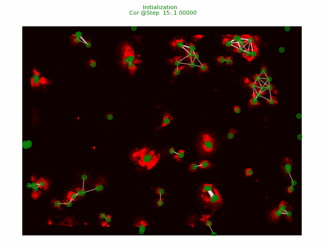

# GNS4CNF-CPBs

## Paper

Yoshikawa C, Nguyen DA, Nakaji-Hirabayashi T, Takigawa I, Mamitsuka H. Graph network-based simulation of multicellular dynamics  driven by polymer brush-modified cellulose nanofibers. ChemRxiv. 2023; [doi:10.26434/chemrxiv-2023-9ll6s](https://doi.org/10.26434/chemrxiv-2023-9ll6s)  This content is a preprint and has not been peer-reviewed.

## Data

Takigawa, Ichigaku; Mamitsuka, Hiroshi; Yoshikawa, Chiaki (2024). GNS\_CNF-CPB. figshare. Dataset. [https://doi.org/10.6084/m9.figshare.25124147](https://doi.org/10.6084/m9.figshare.25124147)

- [211116hMSC-STD.zip](https://figshare.com/ndownloader/files/44346908) (260.54 MB)
- [movies.zip](https://figshare.com/ndownloader/files/44359604) (70.35 MB)

## Code

### Download code

Download the code and extract to have the following folder structure:

```
--code/
    |-- Cells1/
    |-- Cells2/
    |-- Cells3/
    |-- figs/
    |-- env.yml
    |-- README.md
    |-- requirements.txt
```
Note: The code is inherited and modified from [Learning to Simulate_Google Deep Mind](https://github.com/google-deepmind/deepmind-research/tree/master/learning_to_simulate) to 
adapt to different scenarios. 


### Setup environment


```shell
    cd code
    conda env create -f env.yml
    conda activate pycell
```

Note: The tensorflow version is < 2.0, and the recommended python version is 3.7.

If you can not install by the above command, please try to create a virtualenv (pycell) with pip packages in requirements.txt
### Data


Download data:
```shell
  curl -L -o dataset.zip https://figshare.com/ndownloader/files/44346908
  unzip dataset.zip
  mv 211116hMSC-STD CellData
```
So that we have the folder structure as follows:

```
--code/
    |-- CellData/
        |--Chondro/
        |--hMSC/
    |-- Cells1/
    |-- Cells2/
    |-- Cells3/
    |-- figs/
    |-- env.yml
    |-- README.md
    |-- requirements.txt
```

### Run Codes 

- Enter the corresponding folder of a scenario. 
(Scenario 1: Cells1, Scenario 2: Cells2, Scenario 3: Cells3)

E.g. with Cells1
```shell
    cd Cells1
```
For other scenarios, change Cells1 to Cells2 or Cells3

- Converting data and generating scripts
```shell
	python -m converting_data.gen_files
	python -m converting_data.converting_to_tfrecord2
```

After converting, the names of the data are in "data_names.txt", which will be used for args of the below commands.
(data_name: hmsc_high, hmsc_control, hmsc_low, chondro_high, chondro_control, chondro_low)
Note: For scenario 3, the data_name will be {data_name: hmsc, chondro}

The scripts are: run_1_train.sh, run_1_rollout.sh, run_1_rendering.sh for training, rollout testing, and rendering, respectively.

- Training

```shell
    ./run_1_train.sh {data_name}

```
E.g.:  ./run_1_train.sh chondro_high

(For Scenario 3: ./run_1_train.sh chondro)

- Rollout testing:
```shell
    ./run_1_rollout.sh {data_name} {test_file_index: 0|1|2|3}

```
E.g. python run_1_rollout.sh chondro_high 0 
- Rendering:
```shell
     ./run_1_rendering.sh {data_name} {renderin_mode: test|train} {test_file_index: 0|1|2|3} 
```
E.g. ./run_1_rendering.sh chondro_high test 0
The output of the rendering is at the corresponding data folder (e.g. Cells1/data1/chondro_high).

Example: 


